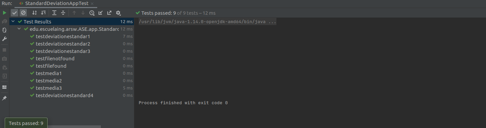

# Standard Deviation App

Este programa calcula la desviacion estandar y la media de un set de n numeros tomados de un archivo.

El aplicativo cuenta con 2 clases la primera es la clase main y la segunda es donde se encuentran cada uno de los metodos encargados de calcular la desviacion estandar y la media, entre ellos estan sumar linked list, obtener un array apartir del texto, y los calculos respectivos del aplicativo

Adicional esta la clase de Test donde estan algunos test realizados para comprobar la solucion del calculo de la desviacion estandar y la media.

Algunos test fueron tomados del instructivo de la actividad.


Los pasos a continuación permiten clonar el programa en su computador.

### Prerrequisitos

Eston son los requisitos que software que tienen que estar instalados previamente:

```
Maven
```
```
Git
```
```
Fue ejecutado con version java 11
```

## NOTA:
* Para tener en cuenta archivos de prueba se encuentran dentro de src/main/resources

## Construcción 
* [Maven](https://maven.apache.org/) - Dependencias de maven

## Autores

* **Mateo Quintero Acevedo** 

## LOC

	220 lineas en 8 horas
	27 lineas codigo por hora

## TEST
  


## Javadoc

* El javadoc fue obtenido mediante la herramienta intelliJ quien cuenta con la opcion de autogenerado
	
## Licencia

En este proyecto se usó la licencia GNU - se puede ver [LICENSE](LICENSE) para más detalles.


